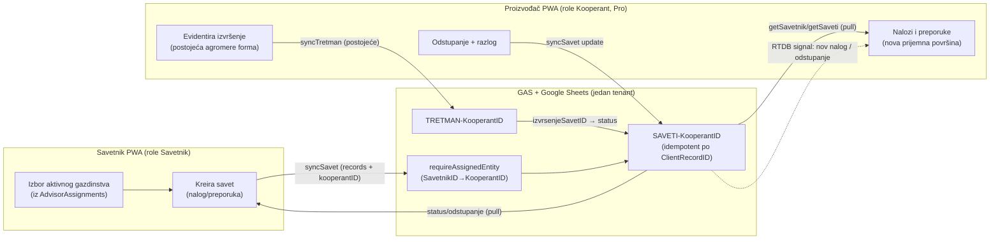
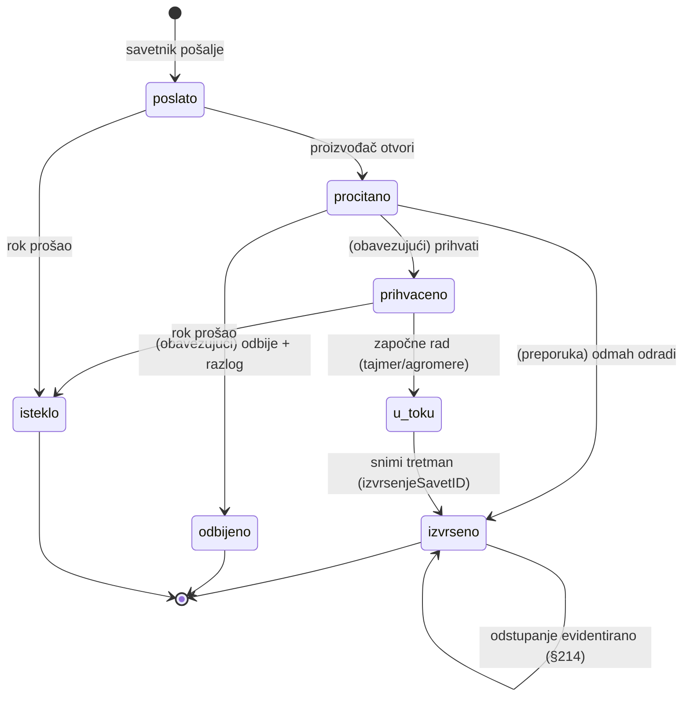

# AgriX Savetnik — skica modula (kako bi funkcionisao)

- **Status:** radna skica (draft) — predlog dizajna, NIJE implementacija
- **Datum:** 2026-07-24
- **Vlasnik:** osnivač AgriX-a
- **Grana:** `claude/agrix-savetnik-modul-skica-275e7w`
- **Izvor odluka:** `docs/Master Plan/09_QA_DECISION_LOG.md` §5 (tačke 196–231) + povezane
  odluke (§75, §78, §82–84, §160, §183–189, §201, §228)
- **Povezani proizvodni dokumenti:** `07_PRODUCT_PORTFOLIO.md` (§8 Gazdinstvo),
  `03_CUSTOMERS_AND_JOBS.md` (§4.9 Agronom / stručna podrška), `08_PRODUCT_ROADMAP.md`
  (Track G — Gazdinstvo validation)
- **Povezani kod (verifikovano pri pisanju skice):** `src/js/features/kooperant/*`,
  `src/js/services/auth.js`, `src/js/utils/sync-engine.js`, `src/js/services/db.js`,
  `gas/Code.gs`, `gas/DriveFolder.gs`, `docs/ARCHITECTURE_REFERENCE.md`

---

## 0. TL;DR

**AgriX Savetnik** je zaseban profesionalni proizvod: jedan agronom/savetnik iz **jednog
interfejsa vodi više Gazdinstava**, šalje im **obavezujući radni nalog** ili **neobaveznu
preporuku** (po parceli/kulturi/meri), i **automatski prati izvršenje** — planirano vs.
urađeno, kašnjenja, utrošene količine, odstupanja. Naplata je **po broju aktivnih
gazdinstava**; licenca Savetnika pokriva **Pro** tih gazdinstava (§198, §200).

Skica polazi od tri utvrđene činjenice iz koda:

1. **Gazdinstvo je PWA domen** (role `Kooperant`). Savetnik je **nova PWA rola** koja
   pozajmljuje već postojeći Gazdinstvo Pro model (tretmani, knjiga polja, parcele) i
   Management „vidi više kooperanata" obrazac.
2. **Ne postoji nijedan entitet plana/naloga/preporuke/statusa izvršenja/odstupanja** —
   to je nov, tanak sloj koji sedi **iznad** postojećeg `tretman` zapisa (planirano →
   izvršeno), a ne paralelna implementacija.
3. **„Jedan savetnik ↔ mnogo gazdinstava" se sudara sa silo-po-tenantu modelom**
   (1 GAS + 1 Drive + 1 IndexedDB po klijentu; tenant se bira URL-om **pre** logina).

Zato je predlog **fazni**:

- **v1 (do sezone 2027):** Savetnik **unutar jednog tenanta** (interna agronomska služba
  hladnjače; ili sva gazdinstva u istom silosu) — izvodljivo malim izmenama, reuse-first.
- **v2+ (posle 2027):** pravi **cross-silo** Savetnik = isti problem kao **multi-Enterprise**
  i **globalni identitet proizvođača** (§82–84); traži federacijski/multi-tenant sloj —
  fundamentalna promena, van 2027 minimuma i van „ne usporavaj Enterprise" ograničenja (§203).

---

## 1. Svrha i opseg skice

**Šta ova skica jeste:** predlog kako bi Savetnik funkcionisao, mapiran na **stvarnu**
arhitekturu (role, silo model, Gazdinstvo Pro podaci, sync), sa jasno izdvojenim
minimalnim v1 opsegom i poštenim prikazom arhitektonskog ograničenja.

**Šta nije:** nije implementacija, nije ugovorno obećanje roadmap-a (§235, `10_*`),
nije cenovnik (apsolutni iznosi ostaju otvoreni — QA §9/3).

**Doktrina (iz `CLAUDE.md`):** `reuse > new`, `extend > duplicate`, `minimal change`,
`verify > conclude`. Sve što nije provereno u kodu je označeno kao pretpostavka.

---

## 2. Proizvodne odluke → posledice po dizajn

Mapiranje QA odluka na konkretne dizajn-obaveze:

| # | Odluka (QA §5) | Posledica po dizajn |
|---|---|---|
| 197, 204 | Jedan savetnik vodi više gazdinstava iz jednog interfejsa; timovi kasnije | v1: **jedan nalog = jedna osoba**; multi-gazdinstvo scope; bez team/RBAC podele |
| 198, 200, 225 | Naplata po aktivnim gazdinstvima; licenca pokriva njihov Pro | Potreban **registar veza** savetnik→[gazdinstvo] sa stanjem `aktivno`; to je i naplatni i pristupni ključ |
| 201, 228 | Proizvođač zadržava svoj nalog i sve podatke; savetnik odmah gubi pristup na prekid | Podaci su **proizvođačevi**; savetnik je **autor** (atribucija), ne vlasnik; opoziv = brisanje veze, zapisi ostaju |
| 211 | Gazdinstvo Pro ostaje isti proizvod; savetnik dobija planerske/kontrolne funkcije; planovi stižu u Pro naloge | Nov sloj **na strani savetnika**; na strani proizvođača samo **prijemna površina** „Nalozi i preporuke" |
| 212 | Savetnik bira: obavezujući radni nalog ILI neobavezna preporuka | Jedan entitet `savet` sa poljem `obavezujuci: bool` (ne dva entiteta) |
| 213 | Automatski status, kašnjenja, utrošene količine, odstupanja | **Planirano-vs-urađeno**: `savet` (plan) ↔ `tretman` (izvršenje) veza + status |
| 214 | Proizvođač evidentira odstupanje + razlog; savetnik dobija upozorenje | Polja `odstupanje/odstupanjeRazlog` + notifikacija ka savetniku |
| 205 | Isto gazdinstvo može biti i uz Savetnika i uz jednu/više hladnjača | **Cross-silo/više veza** — jezgro izazova (sekcija 4) |
| 206, 207, 215 | Interne agronomske službe = ravnopravna grupa; ista tarifa | v1 **prirodno pokriva** interni-agronom slučaj (sva gazdinstva u jednom tenantu) |
| 209, 210 | Proba 30 dana, do 10 aktivnih gazdinstava | Cap na broj `aktivno` veza tokom probe |
| 216 | GGAP-minimum je u GGAP modulu; agrosaveti preko toga su Savetnik | `savet` je **savetodavni**, ne GGAP-evidencija; izvršenje (`tretman`) sme da hrani GGAP kroz postojeći put |
| 226, 227 | Samostalna proba; posle probe read-only do plaćanja | Nalog ima `stanje = proba/aktivan/read-only`; ista mehanika kao Gazdinstvo (§171, §173) |
| 229, 230 | Dugoročno marketplace; ne pre kraja 2027 | Van skice; v1 je alat, ne marketplace |

---

## 3. Gde Savetnik seda u postojeću arhitekturu

### 3.1 „Gazdinstvo je samo PWA" — potvrda uz jednu nijansu

Tačno za **klijent/UX i domen**: Gazdinstvo (role `Kooperant`) i Savetnik su PWA. Tretmani
i knjiga polja se **kreiraju i sinhronizuju iz PWA** (`agromere.js`, `knjiga-polja.js` →
`syncTretman`/`syncTrosak`), a desktop VBA ih ne poseduje kao izvor istine
(`ARCHITECTURE_REFERENCE.md` §2.1: „Kooperant treatment evidence … Primary writer:
Kooperant/Management PWA via GAS").

**Nijansa koju skica ne sme da sakrije:** **provizionisanje naloga i identiteta danas nije
PWA.** Korisnici žive u `Stammdaten!Users` (`gas/Code.gs:1196-1200`: kolone
`Username, PIN, Role, EntityID, DisplayName`), a `KOOP-xxxxx` id **generiše VBA desktop**
(`src-vba/modKooperant.bas:93`, `GetNextID`). Standalone Savetnik i standalone Gazdinstvo
(kupljeno bez Enterprise-a, §160) traže **način da se nalog i `KOOP-` id kreiraju bez
desktopa** — to danas ne postoji i jeste deo izazova (sekcija 4 i 12).

### 3.2 Postojeće role i silo model (verifikovano)

- **Role (GAS enum, `gas/Code.gs:1502`):** `['Management', 'Otkupac', 'Kooperant', 'Vozac']`.
  Savetnik = **nova rola**. Klijent rutira UI po roli (`src/js/ui/role-nav.js`,
  `src/js/services/auth.js:174-194`).
- **Silo-po-tenantu:** 1 GAS `/exec` + 1 Drive + 1 IndexedDB po klijentu; tenant se bira
  URL-om (`?t=slug`) **pre logina** i fiksira ceo `CONFIG`
  (`src/js/config.js:35-109`: jedan `API_URL`, jedan `TOKEN`, jedan `DB_NAME`).
- **Jedan token = jedna role + jedan `entityID`** (`gas/Code.gs:1215-1223, 1263-1268`).
  Ne postoji „jedan korisnik → lista entiteta".
- **`tenantId` ne postoji** ni na zapisima, ni u kolonama, ni u tokenu — tenant je
  implicitan (koji se GAS gađa).

### 3.3 Gazdinstvo Pro površine koje Savetnik pozajmljuje

Kooperant tabovi (`index.html`, `role-nav.js`): `home`, `parcele`, `agromere`,
`knjigapolja`, `more` (`kartica`, `koopinfo`). Persistovani domenski entiteti su **samo dva**:

| Entitet | PWA store | Server sheet | Kreiranje | Sync action |
|---|---|---|---|---|
| `tretman` | `tretmani` | `TRETMAN-<KooperantID>` | `agromere.js:1044-1098` (`dbPut`) | `syncTretman` |
| `trosak` | `troskovi` | `TROSKOVI-<KooperantID>` | `knjiga-polja.js:566-585` (`dbPut`) | `syncTrosak` |

Read-only izvedeno: proizvodnja/otkupi (iz `Kartice`), lager (`magacinkoop`), parcele
(`stammdaten.parcele`), kartica, meteo, config.

**Najvažniji reuse-oslonci:**

- **`tretman` zapis** (`agromere.js:1044-1096`) već nosi `mera`
  (`Zastita/Prihrana/Rezidba/Zalivanje/Berba`), `parcelaID`, `artikalID`,
  `dozaPreporucena` vs `dozaPrimenjena`, `karencaDana`, `datumBerbeDozvoljeno`, `meteo*`,
  `vremePocetka/Zavrsetka/trajanjeMinuta`, `geo*`. To je gotov „izvršni" zapis; par
  `dozaPreporucena`↔`dozaPrimenjena` je **jedini postojeći analog planirano-vs-urađeno**,
  ali nastaje tek u trenutku izvršenja — nema **prethodnog plana**. Savetnik dodaje taj plan.
- **Detalj parcele** (`parcele.js:736-771`) je već „po-parceli" agregaciona tačka sa
  deep-linkom `goToNewRadFromParcela()` (`parcele.js:964-974`) na `agromere` sa
  preselektovanom parcelom — **prirodno mesto** gde nalozi/preporuke sedaju i odakle se
  pokreće izvršenje.
- **Management `kooperanti.js`** (`:216-260`) je već „izaberi kooperanta → gledaj njegove
  podatke" obrazac — UI predložak za Savetnikovu listu gazdinstava.
- **Sync engine** (`sync-engine.js:227-473`): `syncStatus` `pending→syncing→synced`,
  idempotencija po `clientRecordID`, server dodeljuje `serverRecordID`, rollback/retry —
  **preuzima se u celosti** za nov entitet.
- **Firebase RTDB „intercom"** (`config.js` + `intercom-monitor.js`) je već ožičen
  realtime kanal po entity-ID — presedan za lagana obaveštenja („nov nalog", „odstupanje"),
  dok kanonski transport ostaje GAS+Sheets.

---

## 4. Centralni izazov: jedan savetnik ↔ mnogo gazdinstava

### 4.1 Šta arhitektura DANAS dozvoljava

- Unutar **jednog tenanta**, role `Management` je de-facto „vidi/piši sve kooperante":
  na write sync granama Management **zaobilazi** entity-check
  (`gas/Code.gs:920-969`: `if (!isManagement(td) && !requireEntity(...))`) — sme da upiše
  `tretman/trosak/oprema/agromere` za **bilo koji** `kooperantID` u tom tenantu.
- Management već enumeriše sve kooperante iz `getStammdaten().kooperanti`.

### 4.2 Šta arhitektura DANAS NE dozvoljava (gap-ovi)

1. **Read-asimetrija (kritično).** Management **nema** bypass u `handleAuthorizedRead` za
   `getTretmani` (`552-558`), `getTroskovi` (`576-582`), `getOprema` (`560-566`),
   `getKooperantProizvodnja` (`568-574`) — te grane traže striktno
   `tokenData.entityID === kooperantID`. Pošto Management token ima **prazan** `entityID`,
   danas **ne može da pročita** tretmane/troškove ni za jedno gazdinstvo (samo karticu
   preko `getMgmt*`). Savetnik koji čita knjigu polja/tretmane za više farmi zahteva **nove
   read grane** (`getSavetnik*` / `getMgmtTretmani`) ili scoped bypass u tih par `if`-ova.
2. **Nema scoping-a na PODSKUP.** Management vidi/piše **sve** u tenantu; „savetnik vodi
   svojih 12 od 400 gazdinstava" ne postoji — nema tabele veze `savetnik→[KOOP-…]` niti
   provere te veze.
3. **Klijent hardkodira `kooperantID = CONFIG.ENTITY_ID`** (`sync-engine.js:242,300`,
   `knjiga-polja.js:572`). Treba pojam „aktivno gazdinstvo" u sesiji.
4. **IndexedDB nije particionisan po kooperantu** — stores `tretmani`/`troskovi` nemaju
   index po `kooperantID` (`db.js:42-58`); offline za više farmi bi mešao queue-ove.

### 4.3 Da li su sva gazdinstva jednog savetnika u istom GAS-u?

**Danas — moraju, a arhitektura to ne premošćuje.** Token izdaje jedan GAS i validan je
samo tamo (`ScriptProperties` per-projekat). Nema deljenog identity provider-a, nema
`tenantId`, nema cross-GAS poziva. Zato:

- **Sva gazdinstva u istom tenantu** (interna agronomska služba jedne hladnjače; ili
  gazdinstva istog otkupljivača) → izvodljivo **malim izmenama**.
- **Gazdinstva u različitim silosima** (§205 realan slučaj za nezavisnog savetnika) →
  danas **nemoguće iz jednog naloga**; traži federacijski sloj iznad više GAS-ova ili
  prelazak na jedinstveni multi-tenant backend sa `tenantId`. **Fundamentalna promena.**

### 4.4 Tri opcije + preporuka

| Opcija | Opis | Pokriva | Cena promene |
|---|---|---|---|
| **A. Savetnik unutar tenanta** | Nova role + veza-tabela + scoped read/write u postojećem GAS-u | Interne agronomske službe (§206, §215); sva gazdinstva u istom silosu | **Mala** — reuse Management obrasca |
| **B. Savetnik silos + grant/replikacija** | Savetnik ima svoj workspace; gazdinstvo iz svog silosa daje grant; sync replicira | Nezavisni savetnik preko više hladnjača (§202, §205) | **Velika** — cross-tenant sync/identitet (ne postoji) |
| **C. Standalone Gazdinstvo identitet** | Odvezati gazdinstvo od hladnjača-silosa; globalni identitet proizvođača | §160 (Gazdinstvo bez Enterprise-a) + pravi Savetnik + §84 | **Najveća** — temeljna re-arhitektura |

**Preporuka:** **v1 = Opcija A**, sa modelom podataka projektovanim tako da migracija ka
B/C **ne lomi** zapise (od početka nositi `autorTip/autorId` i `kooperantID` na `savet`
zapisu; predvideti buduće `tenantId`). B/C su isti problem kao multi-Enterprise (§82–83) i
globalni identitet (§84) — legitimno **post-2027** (QA otvoreno pitanje #2), i eksplicitno
van „ne usporavaj Enterprise proizvodni sistem" (§203).

> **Odluka koju skica traži od vlasnika:** da li je v1 Savetnik namenjen **internom
> agronomu / jednom silosu** (Opcija A, brzo, do 2027) ili se odmah cilja nezavisni
> cross-silo savetnik (Opcija B/C, post-2027)? Ostatak skice pretpostavlja **A za v1**.

---

## 5. Model identiteta, role i pristupa (v1, Opcija A)

- **Nova role `Savetnik`** u GAS enumu (`gas/Code.gs:1502`) i u klijentskom
  role-routingu (`role-nav.js`, `auth.js`). Login je isti (username + PIN → token);
  `EntityID` savetnika = npr. `SAV-xxxxx`.
- **Registar veza (izvor pristupa i naplate):** nov tab `AdvisorAssignments`
  (ili `SavetnikVeze`) u `Stammdaten`: `SavetnikID | KooperantID | Stanje(aktivno/pauzirano)
  | Tip(nalog+preporuka dozvoljeni) | DatumOd | DatumDo`. Ova tabela je **jedini** izvor
  „koja gazdinstva savetnik sme da vidi/menja" i „koja se naplaćuju" (§198, §200).
- **Serverski guard:** nov helper `requireAssignedEntity(tokenData, kooperantID)` koji
  proverava `AdvisorAssignments`; primenjuje se na write grane (umesto/pored `isManagement`,
  `920-969`) i na **nove** scoped read grane (`getSavetnik*`) koje rešavaju read-asimetriju
  iz 4.2.1.
- **Licenca/Pro:** veza `aktivno` **uključuje Pro** za to gazdinstvo (§200) — proizvođač ne
  plaća zaseban Pro dok ga savetnik pokriva; gašenje veze vraća gazdinstvo na njegov
  prethodni paket (§169 analog).
- **Proba:** `stanje = proba` sa cap-om ≤ 10 `aktivno` veza (§209–210); posle probe
  `read-only` do plaćanja (§227).
- **Prekid saradnje (§228):** brisanje/`pauzirano` veze → savetnik **odmah** gubi pristup
  (guard pada); **svi `savet` i `tretman` zapisi ostaju** kod proizvođača (oni su njegovi,
  §183, §201). Atribucija autora ostaje na zapisu radi istorije.

---

## 6. Domenski model: radni nalog / preporuka / izvršenje / odstupanje

Nov, tanak sloj **iznad** postojećeg `tretman`. Jedan entitet `savet` (ne dva — §212 je
polje, ne tip), koji se **izvršava** postojećim `tretman` zapisom.

### 6.1 Nov entitet `savet` (predlog strukture)

Prati konvencije postojećih zapisa (`agromere.js:1044-1096`), reuse sync polja:

```
// PWA store: 'saveti'  (keyPath: clientRecordID)
{
  clientRecordID, serverRecordID,                 // isti idempotency model kao tretman
  createdAtClient, updatedAtClient, updatedAtServer, syncedAt,

  autorTip: 'savetnik', autorId: <SAV-…>,         // ATRIBUCIJA (ostaje i posle opoziva)
  kooperantID: <KOOP-…>,                          // ciljno gazdinstvo (i sheet sufiks)
  parcelaID,                                       // opciono (može biti savet za celo gazd.)

  obavezujuci: true|false,                         // §212: radni nalog vs preporuka
  mera,                                            // isti enum kao tretman (Zastita/…)
  artikalID, artikalNaziv, dozaPreporucena, jedinicaMere,  // šta i koliko (plan)
  rok,                                             // do kada (za kašnjenja §213)
  naslov, opis, napomena,

  statusIzvrsenja: 'poslato'|'procitano'|'prihvaceno'|'u_toku'|'izvrseno'|'odbijeno'|'isteklo',
  izvrsenjeTretmanID,                              // veza na tretman koji ga je izvršio
  odstupanje: false, odstupanjeRazlog: '', odstupanjeKolicina: null,  // §214

  syncStatus, syncAttempts, syncAttemptAt, lastSyncError, lastServerStatus,
  deleted: false, entityType: 'savet', schemaVersion: 1
}
```

- **Server:** `SAVETI-<KooperantID>` po-kooperant sheet (isti obrazac kao
  `TRETMAN-<KooperantID>`, `Code.gs:2122-2123`), idempotencija po `ClientRecordID`.
- **IndexedDB:** nov `schemaItem 'saveti'` u `buildDbSchema()` + `DB_VERSION 6→7`
  (`db.js`; napomena: legacy `agromere` store se briše pri migraciji `db.js:82-84` —
  presedan za dodavanje/uklanjanje store-a). Indeksi: `syncStatus`, `kooperantID`,
  `parcelaID`, `statusIzvrsenja`, `rok`.

### 6.2 Planirano-vs-urađeno (izvršenje)

- Proizvođač u svom Pro nalogu vidi `savet`, klikne „Evidentiraj izvršenje" → otvara se
  **postojeća** `agromere` forma **preselektovana** iz `savet` (parcela, mera, artikal,
  `dozaPreporucena`) — deep-link u duhu `goToNewRadFromParcela()` (`parcele.js:964-974`).
- Snimanjem `tretman` dobija `izvrsenjeSavetID = savet.clientRecordID`; `savet.statusIzvrsenja`
  napreduje u `izvrseno`. **`dozaPrimenjena` na tretmanu** je stvarno urađeno; razlika prema
  `savet.dozaPreporucena` je automatsko **odstupanje po količini** (§213).
- **Kašnjenje:** `rok < danas && status ∉ {izvrseno, odbijeno}` → `isteklo`/kasni (§213),
  računa se klijentski kao u `pregled.js:165-169`.
- **Odstupanje (§214):** proizvođač postavlja `odstupanje/odstupanjeRazlog` (na `savet` ili
  kroz `tretman.napomena`) → savetnik dobija upozorenje (RTDB signal + lista alerta).

---

## 7. Sinhronizacija i tok podataka (v1, isti tenant)



- **Nova sync grana `syncSavet`** (ogledalo `syncTretman`, `Code.gs:943`): guard
  `requireRole(Savetnik/Management) + requireAssignedEntity`. Payload isti oblik
  `{records, kooperantID}` (`sync-engine.js:299-300`) — ali `kooperantID` je **izabrano
  aktivno gazdinstvo**, ne `CONFIG.ENTITY_ID`.
- **Novi read grane `getSaveti`/`getSavetnikPortfolio`** — rešavaju read-asimetriju (4.2.1)
  scoped na dodeljena gazdinstva.
- **Izvršenje ide postojećim `syncTretman`** — proizvođačev app se **ne menja** u toku
  snimanja tretmana; samo dobija prijemnu površinu i „evidentiraj iz naloga" deep-link.
- **Skalabilni oprez:** GAS `withLock` je **jedan po tenantu** (`Code.gs:5307-5361`) →
  masovni sync više farmi se serijalizuje; za veći portfolio predvideti batch-po-gazdinstvu.

---

## 8. Životni ciklus statusa naloga



Napomena: za **preporuku** (`obavezujuci=false`) `prihvaceno`/`odbijeno` su opcioni —
preporuka ne blokira, samo se prati da li je odrađena.

---

## 9. UI površine

### 9.1 Savetnik interfejs (nova role-nav grupa)

Reuse Management shell obrasca (`mgmt-shell-v2.js`, `kooperanti.js`):

- **Portfolio** — lista dodeljenih gazdinstava sa statusom (aktivni nalozi, kašnjenja,
  odstupanja); brojači kao u `pregled.js`.
- **Gazdinstvo → detalj** — reuse read-only prikaza po parceli (`parcele.js:736-771`):
  parcele, istorija tretmana, lager, karenca; + „Novi nalog/preporuka".
- **Forma naloga/preporuke** — varijanta `agromere` wizarda (`agromere.js`) **bez** tajmera
  i GPS-a (to je plan, ne izvršenje): parcela → mera → artikal → `dozaPreporucena`
  (reuse `agroCalcPreporuka()` `:609-676`) → `obavezujuci` toggle → `rok` → pošalji.
- **Pregled izvršenja** — planirano vs urađeno; odstupanja; export (za §213/analitiku).

### 9.2 Proizvođač strana (postojeća role `Kooperant`, minimalan dodatak)

- **Nova prijemna površina „Nalozi i preporuke"** — tab ili kartica na `home`/`parcele`:
  lista `savet` zapisa sa statusom; akcije „Prihvati / Odbij", „Evidentiraj izvršenje"
  (deep-link u `agromere` preselektovano), „Prijavi odstupanje + razlog".
- **Prikaz po parceli** — `savet` zapisi za tu parcelu u postojećem detalju parcele.
- Ostatak Pro aplikacije **nepromenjen**.

---

## 10. Granice i pravila

- **GGAP granica (§216):** `savet` je **savetodavni** zapis, **ne** GGAP-evidencija. Sve
  neophodno za GGAP ostaje u GGAP modulu; izvršenje (`tretman`) sme da hrani GGAP kroz
  postojeći put, ali `savet` sam po sebi nije dokaz usaglašenosti.
- **Odnos prema Pro (§211):** Gazdinstvo Pro je **isti** proizvod; Savetnik dodaje sloj i
  prijemnu površinu, ne menja Pro tokove.
- **Privatnost/vlasništvo (§183–189, §201, §228):** podaci su proizvođačevi; savetnik je
  autor sa pristupom **preko veze**; opoziv = trenutni gubitak pristupa, zapisi ostaju.
  Dodatno deljenje podataka proizvođača (plan proizvodnje, prinos…) ostaje **opt-in** uz
  saglasnost (§188–189; pravna razrada otvorena — QA #1).
- **Bez trajnog forka (§22, §74, `CLAUDE.md`):** Savetnik je zajednička funkcija proizvoda,
  ne klijentska grana.

---

## 11. Fazni plan

**v1 — do sezone 2027 (Opcija A, isti tenant), reuse-first:**

1. Nova role `Savetnik` + `AdvisorAssignments` tab + `requireAssignedEntity`.
2. Nov entitet `savet` (`saveti` store, `DB_VERSION 6→7`), `syncSavet`, `SAVETI-<KooperantID>`.
3. Nove scoped read grane (rešiti read-asimetriju 4.2.1).
4. Klijent: „aktivno gazdinstvo" + slanje izabranog `kooperantID` (`sync-engine.js:242,300`);
   particionisanje pending queue-a po kooperantu (`db.js` index/ključ).
5. Savetnik UI (portfolio + forma) reuse Management/agromere; proizvođač prijemna površina.
6. Planirano-vs-urađeno + odstupanje; RTDB signal (opciono).
7. Proba 30 dana / ≤10 gazdinstava; read-only posle probe.

**v2+ — posle 2027 (van „ne usporavaj Enterprise", §203):**

- Cross-silo (Opcija B/C) = federacija/multi-tenant sa `tenantId`; vezano za multi-Enterprise
  (§82–83) i globalni identitet proizvođača (§84).
- Timovi i raspodela (§204); marketplace (§229–230, ne pre kraja 2027).
- Provizioni partner-tok (§219–223).

---

## 12. Otvorena pitanja

**Tehnička (specifično za Savetnik):**

1. **Cross-silo (linchpin).** Da li v1 ostaje isti-tenant (Opcija A) ili se ide na
   federaciju? Vezuje se za QA otvoreno pitanje #2 (redosled GGAP / marketplace /
   multi-Enterprise).
2. **Provizionisanje bez desktopa.** Standalone Savetnik/Gazdinstvo traže minting naloga i
   `KOOP-`/`SAV-` id-jeva bez VBA desktopa (danas `modKooperant.bas:93`). Gde živi taj
   servis?
3. **Gde `SAVETI-*` živi u cross-silo slučaju** (proizvođač i savetnik u različitim
   silosima) — replikacija vs. federacija.
4. **Naplatni obračun „aktivnog gazdinstva"** — životni ciklus veze (proba→aktivno→pauza)
   kao naplatni događaj.
5. **Skalabilnost sync-a** — `withLock` po tenantu; batch po gazdinstvu za veći portfolio.
6. **Finalni enum statusa i model odstupanja** (na `savet` vs na `tretman`).

**Proizvodno/pravno (iz QA §9):**

- Povlačenje saglasnosti za dodatno deljenje podataka (§189, QA #1).
- Apsolutni cenovnik Savetnika po aktivnom gazdinstvu (QA #3).
- Pravila partnerskog programa/provizije/atribucije (QA #5, §219–223).

---

## 13. Ne-ciljevi / odbijene alternative

- **Dupliranje `tretman`/`trosak` modela** — odbijeno; `savet` **reuse** konvencije i sedi
  iznad izvršenja (anti-duplication, `CLAUDE.md` §2).
- **Dva entiteta (nalog vs preporuka)** — odbijeno; jedno polje `obavezujuci` (§212).
- **Trajni klijentski fork za savetodavne firme** — odbijeno (§22, §74).
- **Pun cross-silo/multi-tenant u v1** — odbijeno za v1 (§203; to je post-2027 re-arhitektura).
- **Marketplace u v1** — odbijeno (§230, ne pre kraja 2027).

---

## Dodatak A — konkretna „šta treba" mapa (v1, isti tenant)

| Sloj | Izmena | Reuse / referenca |
|---|---|---|
| GAS auth | role `Savetnik` u enum; `SAV-` EntityID | `Code.gs:1502`, `Users` tab `1196-1200` |
| GAS veze | `AdvisorAssignments` tab + `requireAssignedEntity()` | uz `requireEntity` `Code.gs:298` |
| GAS write | `syncSavet` (guard role+assigned) | ogledalo `syncTretman` `Code.gs:943` |
| GAS read | `getSaveti`/`getSavetnikPortfolio`; scoped bypass za `getTretmani/getTroskovi` | rešava asimetriju `Code.gs:552-582` |
| Sheets | `SAVETI-<KooperantID>` (idempotent) | obrazac `TRETMAN-*` `Code.gs:2122` |
| PWA store | `saveti` store, `DB_VERSION 6→7`, indeksi | `db.js buildDbSchema`, migracija `:82-84` |
| PWA sync | `syncSaveti` wrapper; slati izabrani `kooperantID` | `sync.js:14-41`, `sync-engine.js:242,300` |
| PWA DB | particionisati pending queue po `kooperantID` | `db.js:42-58` (nema tog indeksa) |
| PWA role | `Savetnik` u role-nav/auth | `role-nav.js`, `auth.js:174-194` |
| PWA UI (savetnik) | portfolio + forma naloga | reuse `management/kooperanti.js`, `agromere.js` |
| PWA UI (proizvođač) | prijemna površina „Nalozi i preporuke" | uz `parcele.js:736-771`, `pregled.js` |
| Realtime (opc.) | RTDB signal „nov nalog"/„odstupanje" | presedan `intercom-monitor.js` |

_Sve reference verifikovane u kodu na dan pisanja skice; pre implementacije proveriti
stvarne nazive kolona i schema drift (`CLAUDE.md` §4)._
